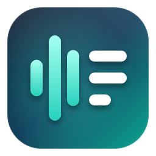

#  AudioTranscriber

Native Windows x64 recording and transcription with a .NET 10 WPF desktop
interface, durable local audio, searchable transcripts, and optional NVIDIA ASR.

Record the **selected Windows output endpoint**, optionally with a separately
timestamped microphone, or import a long audio/video recording. Transcription
never sits in the capture callback: slow inference or an unavailable network
leaves the original recording on disk.

| Workflow | First-version behavior |
| --- | --- |
| Recording | Visible Start/Stop, selected WASAPI endpoint, separate optional mic, native-format rotated WAVs, explicit gaps/overflow/disk errors |
| Long imports | FFprobe audio-stream selection, managed original copy, continuous FFmpeg normalization, resumable durable work |
| Recognition | Local Parakeet TDT v3 by default (CPU, auto-downloaded, 25 European languages); optional local Whisper large-v3-turbo for any language, whose unsure chunks are re-checked by local Parakeet; three optional NVIDIA Riva routes; source-language ASR, no translation or automatic fallback on errors |
| Speakers | Local segmentation plus clean-turn embeddings and persistent IDs; editable names; overlap/short-turn uncertainty |
| Transcript | SQLite FTS, bounded pages, speaker filtering, corrections separate from source text, timestamp seek and playback |
| Exchange | Text, JSON, SRT, WebVTT; local voice-tag VTT import; configured delegated Teams transcript retrieval |
| Output templates | Your own prompts (DM guidance, session summary, NPC/item lists…) kept up to date from the live transcript by any OpenAI-compatible LLM: OpenRouter, NVIDIA Build, OpenAI, Ollama/LM Studio on this or another PC; can read a folder of PDFs/notes; shown in the app and optionally written to an unlocked file |

New sessions do not upload audio unless explicitly permitted. NVIDIA's current
terms and finite trial quota apply; personal or confidential material may not be
permitted. Recording and local processing do not require an API key. See
`docs\privacy.md` before enabling uploads.

## Local setup

Use PowerShell from the repository root on Windows x64:

```powershell
.\scripts\Setup.ps1
.\scripts\Start-App.ps1
.\scripts\Start-App.ps1 -Smoke
.\scripts\Test.ps1
.\scripts\Publish.ps1
```

`Setup.ps1` installs **SDK 10.0.401** only into `.tools\dotnet`; it never performs
a global installation or changes your machine's PATH. `global.json` disallows
SDK roll-forward. The setup script discovers the exact Windows x64 ZIP in
[Microsoft's official .NET 10 release metadata](https://builds.dotnet.microsoft.com/dotnet/release-metadata/10.0/releases.json),
accepts only approved Microsoft HTTPS download hosts, verifies the archive's
SHA-512 against that metadata before extraction, and reuses an already installed
pinned local SDK. Downloads, the local CLI home and NuGet cache remain in `.tools`.
Package lock files are retained; test and publish scripts use locked restore.
Development startup, workers, and VSTest use the explicit pinned local `dotnet`
host. Native apphost/image-loading failures were observed intermittently on the
development machine despite valid on-disk bytes; this is not evidence of a model
or source-code defect. Published executables are a separate validation target.

FFmpeg and FFprobe are resolved from the bundled `ffmpeg` folder of a release,
then PATH (including the current registry PATH), then WinGet/Scoop/Chocolatey
locations. Release ZIPs bundle a pinned, SHA-256-verified LGPL FFmpeg build, so a
clean PC needs no separate install; for development, `Setup.ps1` warns when FFmpeg
is not on PATH. Local Whisper also needs the Microsoft Visual C++ 2015-2022 x64
runtime; the app checks it on startup and runs Microsoft's official installer if
it is missing. Setup itself requires no model weights, API keys, recording, or
cloud upload; the desktop app downloads its default models on first start.

Targeted validation and direct local SDK invocation:

```powershell
.\scripts\Test.ps1 -Project .\tests\AudioTranscriber.Storage.Tests\AudioTranscriber.Storage.Tests.csproj
.\.tools\dotnet\dotnet.exe build .\src\AudioTranscriber.Core\AudioTranscriber.Core.csproj -c Release
```

Publish output is `artifacts\publish\win-x64`; launch `AudioTranscriber.App.exe`
there. Keep the complete output directory together, including the worker and
native runtime libraries. FFmpeg/FFprobe are bundled in the `ffmpeg` folder
(LGPL build; license and provenance under `licenses`).
The package includes documentation, model notices, dependency license files,
and a package inventory under `licenses`.

`Start-App.ps1 -Smoke` uses a fresh isolated directory under `artifacts\smoke`
and reports its `app-smoke.json` path. `-DataRoot PATH` selects a custom data root;
smoke mode rejects nonempty roots rather than running previously queued work.

## MCP hooks for agents

The app exposes two stdio MCP servers for driving and testing it: `--mcp` (headless engine: record,
import, transcribe, diarize, read transcripts) and `--mcp-ui` (launches the real window and clicks
through it via UI Automation, with snapshots and screenshots). `.mcp.json` registers both through
`scripts\Start-Mcp.ps1`; `scripts\New-SpeechFixture.ps1` generates two-speaker test audio. See
`docs\mcp.md`.

## GitHub releases

The release-only workflow builds one self-contained Windows x64 ZIP on Ubuntu
when a valid `vMAJOR.MINOR.PATCH` tag (optionally a prerelease) is pushed. It uses
the pinned SDK, cached locked packages, and a single app/worker build graph; it
does not run tests, benchmarks, or ordinary branch/PR CI. The ZIP and SHA256 file
are published directly to the matching GitHub Release. Each release's notes come
from its section in [`CHANGELOG.md`](CHANGELOG.md); a release fails before tagging
if that section is missing. See `docs\releases.md`
for tag/rerun instructions, safeguards, and the locally verified Linux build.

Installed release builds update themselves from the latest GitHub release: they
download and SHA-256-verify the new ZIP in the background and install it when the
app closes (or on **Restart to update**). See `docs\usage.md` → Updates.

## First session

Download the release ZIP, extract it, run `AudioTranscriber.App.exe`, and click
**Start recording**. Everything has a working default:

- Output: the default Windows output device. Microphone: your default microphone
  as a separate track when one exists. Echo reduction is on, so no headset is needed:
  speaker audio the mic picks up is removed before transcription instead of being
  transcribed twice.
- Transcription: local **Parakeet TDT v3** on the CPU, in English (it also detects
  24 other European languages). The model (465 MiB) and the small speaker-labeling
  models (33.49 MB) download and verify automatically on first start; you can record
  meanwhile and queued audio is transcribed as soon as they are ready. In testing it
  made about a third fewer word errors than Whisper large-v3-turbo and ran 14–20×
  real time with a fraction of Whisper's CPU use. Local Whisper remains available
  for other languages; its model downloads the first time you use it.
- On a PC with an NVIDIA GPU (GTX 10-series or newer, 4 GB+), the app asks once
  whether to download NVIDIA's CUDA runtime (about 4.4 GB, NVIDIA licence terms) so
  Parakeet runs on the GPU instead. If you decline, it stays on the CPU.
- If the Microsoft Visual C++ runtime is missing, its official installer runs on
  startup (approve the Windows prompt).
- No cloud upload, key, or consent is needed. Provider, language, and microphone
  choices are remembered from your last recording.

Optional: pick an NVIDIA provider, supply a memory-only key (or Windows-protected
persistence), and grant session upload consent only for permitted audio. Stop
seals original audio; transcription continues afterward. Pause, Cancel, and
Resume control durable processing separately from recording. Search the
transcript, right-click lines to set who is speaking (labeled lines teach the voice
model, and giving two speakers the same name merges them), edit corrections, and
double-click a row to play it.
An unknown or overlapping voice is not a confirmed identity.

Other Whisper weights can be installed with `scripts\Install-WhisperModel.ps1`
(sizes and licenses are listed there) and selected in the desktop settings.
See `docs\providers.md`.

## What the initial public comparison showed

One live run submitted two complete public LibriSpeech clips to all three NVIDIA
routes: **six attempts, 32.010 seconds of submitted audio, no retries**. Five calls
succeeded; one Parakeet request timed out. Parakeet returned real word timestamps
on its successful clip; Canary and hosted Whisper returned coarse text.

The tiny single-speaker read-speech sample does **not** identify a best D&D model.
Whisper's measured word-error differences were only `Mr.` versus `MISTER`
normalization. Details, failures, settings, hashes, and immutable sanitized public
outputs are retained in `docs\benchmarks\2026-09-11`.

Reproduction consumes new account quota; do not repeatedly run it after a
nonzero exit or treat a failed request as a quality score. The optional credential
bridge takes a configuration **path**, never a key argument:

```powershell
.\scripts\Compare-Models.ps1 -PrepareOnly
.\scripts\Compare-Models.ps1 -ApprovePublicAudioCloud -ProductionConfigPath 'C:\authorized\production.json'
```

## Limits and integration setup

The NVIDIA catalog's selected routes do not claim hosted native diarization.
Word, segment, and coarse chunk timing remain distinct; coarse text cannot
support fabricated word-level seek or certain attribution across several turns.
Local diarization is not source separation. Its segmentation model has three
local voice slots per ten-second window and at most two simultaneous voices,
although the persistent registry can contain more session speakers.

Teams retrieval requires a configured public-client application, work/school
tenant consent, meeting identifiers, and permitted transcript access. It respects
tenant attribution restrictions and is not live Teams media capture. Imported
display names are source labels, not invented participant identifiers.

Discord live receive is deferred pending real bot/DAVE permission, rekey,
reconnect, and packet-loss validation. Universal loopback remains usable without
Discord bot credentials. No user-token/selfbot integration is provided.

## Data and recovery

The data root contains `library.sqlite3`, session folders, original chunks or
managed imports, normalized derivatives, provider evidence, and speaker state.
Back up the whole data root rather than only an exported text file. Do not edit
retained originals or move their individual files behind the app.

Capture rotates at both duration and byte limits, avoiding classic WAV's 4 GiB
per-file limit. Overflow, device loss, write failure, and unavailable audio are
reported rather than silently dropping the oldest data. Periodic disk flushing
reduces exposure; no application can guarantee the last unflushed samples survive
power loss. Recovery verifies manifests and hashes and can replay a continuity
run to reproduce the same resampler state, which takes extra decoding time.

Only one application instance can own a data root. Use `-DataRoot PATH` for an
isolated library. Never point a smoke run at a populated personal library.

See `docs\usage.md`, `docs\audio.md`, `docs\diarization.md`,
`docs\providers.md`, and `docs\privacy.md` for operational details and limitations.
The shipped SQLite native library's exact provenance and hash are in
`src\AudioTranscriber.Storage\NativeSqlite\README.md`.

## Core conventions

`AudioTranscriber.Core` has no UI, capture, inference, or native dependencies.
Native frames, track-global normalized samples, and session-relative 100 ns
ticks are distinct 64-bit coordinates. Normalized ASR files are headerless
little-endian signed PCM16, mono, 16 kHz; a request owns a non-overlapping core
within a maximum 30-second context window. Provider timestamps are integer
milliseconds **relative to supplied audio**, and timing granularity and nullable
confidence must reflect actual provider output. Preserve raw recognition
separately from corrections. Loopback and optional microphone are separate tracks.

No hardware capture test is started automatically. Tests use controlled
synthetic/public data; a physical WASAPI capture check requires separate explicit
consent to a controlled sound source. Tenant-dependent Graph access also requires
real tenant setup.
