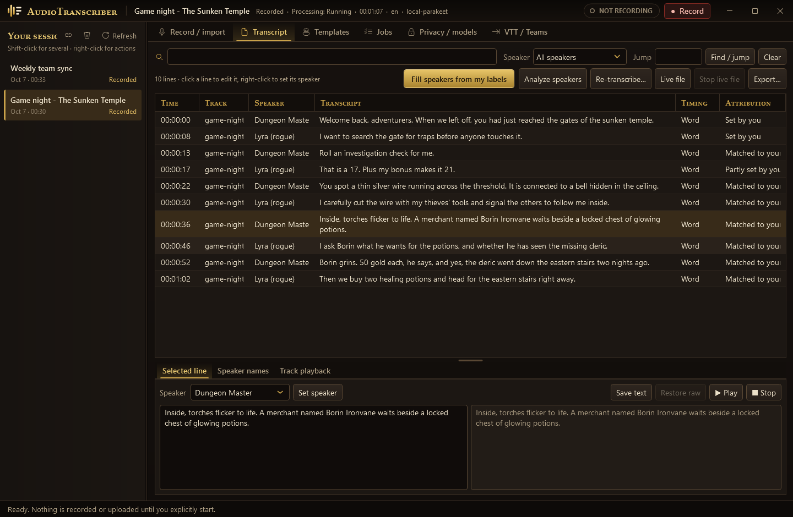
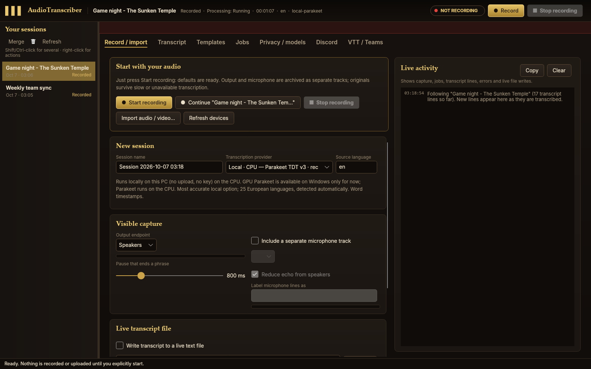
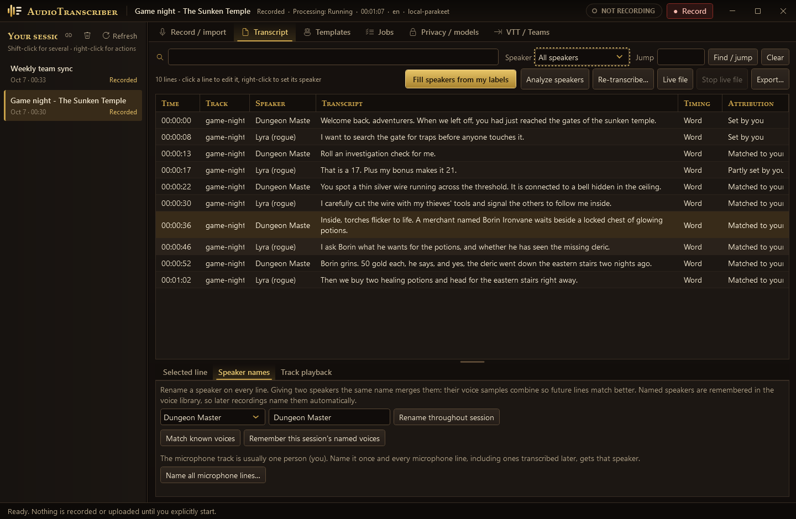
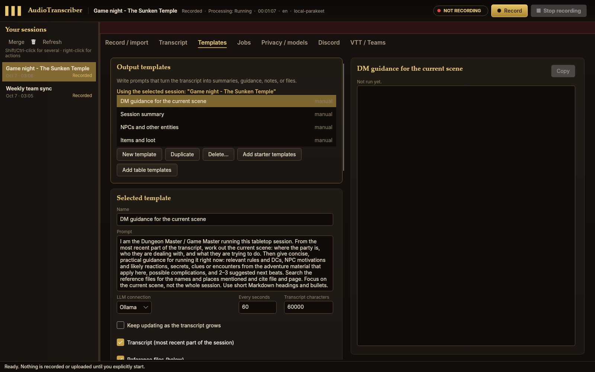
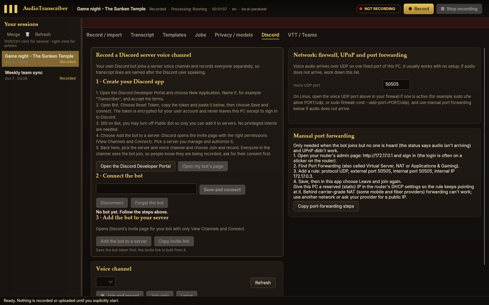
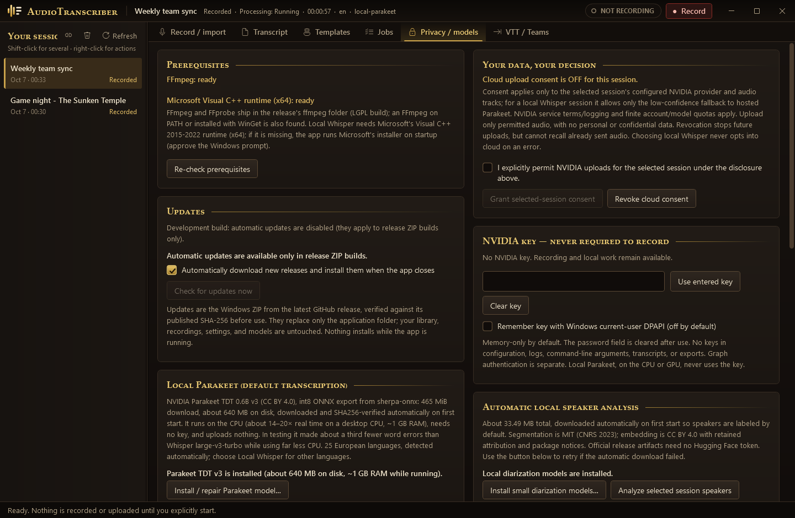

<div align="center">


# AudioTranscriber

### Everything your PC hears, turned into a searchable transcript that knows who said what.

[](https://github.com/throndir2/AudioTranscriber/releases/latest)
[](https://github.com/throndir2/AudioTranscriber/releases)


<a href="https://github.com/throndir2/AudioTranscriber/releases/latest"></a>
&nbsp;
<a href="https://github.com/throndir2/AudioTranscriber/releases/latest"></a>
&nbsp;
<a href="https://www.buymeacoffee.com/throndir" target="_blank"></a>

[Features](#-everything-it-does) · [Screenshots](#-take-a-look) · [Get started](#-up-and-running-in-a-minute) · [Wiki](https://github.com/throndir2/AudioTranscriber/wiki)

</div>

<br>



<p align="center"><i>A game night, transcribed on your own computer with every speaker named. Label two lines yourself and the app labels the rest by voice.</i></p>

---

## 🎧 Never take notes again

Press **Record** and AudioTranscriber captures whatever your PC is playing (a
call, a stream, a game session, a lecture) plus your own microphone. It writes
the words down **live** as people talk, figures out **who is talking**, and
keeps everything in a library you can search.

It runs **on your own PC**: no account, no API key, no upload, no subscription.
The speech model downloads by itself the first time you start the app.

<table>
<tr>
<td align="center" width="25%">🔴<br><b>One click</b><br>Every setting has a working default</td>
<td align="center" width="25%">⚡<br><b>Fast</b><br>14–20× real time on a desktop CPU</td>
<td align="center" width="25%">🗣️<br><b>Knows voices</b><br>Speakers get named and remembered</td>
<td align="center" width="25%">🔒<br><b>Private</b><br>Nothing leaves your PC unless you allow it</td>
</tr>
</table>

## 💡 Made for

> 🎲 **Tabletop game night.** Record the whole session, ask an AI for *"DM guidance for the current scene"* from your own adventure PDFs, and get a list of NPCs and loot that updates as you play. Running Roll20 or Foundry? The **VTT assistant** reads the turn order and battle map from a screenshot and reminds you whose turn it is, what the monsters should do, and which clues you haven't revealed yet.

> 💼 **Meetings and calls.** Teams, Zoom, Discord, whatever your PC plays. Your microphone is its own track and echo reduction means no headset is needed.

> 🎮 **Discord servers.** Invite your own bot to a voice channel and every line is named after the Discord user who said it, no speaker guessing needed.

> 🎓 **Lectures and long recordings.** Import hours of audio or video and come back to a timestamped, searchable transcript. Click any line to hear it.

> 🎬 **Subtitles.** Export SRT or WebVTT with timestamps, or plain text and JSON.

> 🤖 **AI agents.** Built-in MCP servers let Copilot, Claude and other agents record, transcribe and read transcripts for you.

## ✨ Everything it does

<table>
<tr>
<td width="50%" valign="top">

### 🎙️ Record anything
- Captures the **output device** you pick (WASAPI on Windows, PulseAudio/PipeWire on Linux), so it hears everything your PC plays.
- Records **Discord server voice channels** through your own bot, with every line named after the Discord user who said it.
- Adds your **microphone as a separate track**, with **echo reduction** so the call isn't transcribed twice.
- **Import** long audio or video files (FFmpeg is bundled).
- **Continue** a session later, or **merge** sessions that got split.
- The original audio is saved first, so a slow PC never loses a word.

</td>
<td width="50%" valign="top">

### ⚡ Fast, accurate, local
- **NVIDIA Parakeet TDT v3** on your CPU by default: 25 European languages, detected automatically.
- In testing it made **about a third fewer word errors** than Whisper large-v3-turbo and used far less CPU.
- Have an **NVIDIA GPU**? On Windows the app offers to run Parakeet on it instead.
- **Recommended setup for this PC** reads your CPU, RAM and graphics card and fits the speech models and a local AI model to them.
- **Local Whisper** for any other language.
- Optional **NVIDIA cloud** models, only when you allow it for a session.

</td>
</tr>
<tr>
<td valign="top">

### 🗣️ Knows who's talking
- **Automatic speaker labels**, worked out on your PC.
- Right-click a line to **name the speaker**. Name a few lines and **Fill speakers** labels the rest by voice.
- The **voice library** remembers people, so the next recording names them for you.
- Gave someone two names? Use the same name twice and they **merge**.
- Name your **microphone** once and every mic line follows.

</td>
<td valign="top">

### 🔎 A transcript you can use
- **Live text** while you record, with a pause setting for short or long lines.
- **Search** every line, **filter by speaker**, **jump** to a time.
- **Double-click** a line to play the audio.
- **Fix mistakes** without losing what the model originally heard.
- **Re-transcribe** a session with a different phrase pause.

</td>
</tr>
<tr>
<td valign="top">

### 🧠 AI notes that keep up
- **Output templates**: write a prompt once (*session summary*, *DM guidance*, *NPCs*, *action items*) and an AI keeps the answer current as the transcript grows.
- Works with **OpenRouter, NVIDIA Build, OpenAI**, or a model on your own PC with **Ollama or LM Studio**.
- Point it at a folder of **PDFs and notes** to use as reference.
- **Chain templates** together, and let vision models see a **screenshot of your virtual tabletop** (Roll20, Foundry or any window). A ready-made **VTT assistant** turns it into live DM reminders.
- Results show up in the app and can be written to a file.

</td>
<td valign="top">

### 📤 Takes your words anywhere
- Export **text, JSON, SRT and WebVTT**.
- A **live transcript file** that refreshes as you talk. Keep it open in VS Code or any other app.
- Import **WebVTT** transcripts (for example from Teams or Zoom) as new sessions.
- **MCP servers** for AI agents, both headless and driving the real window.

</td>
</tr>
</table>

**Plus the small things:** real installers for Windows and Linux (`.exe`, `.deb`,
`.rpm`), automatic updates from GitHub releases (checked against SHA-256 before
installing), a live activity log that shows what's happening, a jobs view with
pause, resume and cancel, bulk-deleting old sessions, safe recovery after a crash, a
one-click **diagnostics ZIP** for bug reports (with your user name scrubbed), and a
dark gold theme.

## 📸 Take a look

<table>
<tr>
<td width="50%"><p align="center"><b>Press Start and go</b><br>Sensible defaults, live activity on the side.</p></td>
<td width="50%"><p align="center"><b>Name a voice once</b><br>Rename, merge and remember speakers.</p></td>
</tr>
<tr>
<td><p align="center"><b>Output templates</b><br>Your prompts, updated from the live transcript.</p></td>
<td><p align="center"><b>Record Discord servers</b><br>Guided bot setup; every line named after its speaker.</p></td>
</tr>
<tr>
<td colspan="2" align="center"><p align="center"><b>You stay in control</b><br>Local models, consent per session, a voice library you can see and edit.</p></td>
</tr>
</table>

<p align="center"><sub>The same app and dark gold theme on Windows and Linux (screenshots taken on Linux).</sub></p>

## 🚀 Up and running in a minute

1. **[Download the latest release](https://github.com/throndir2/AudioTranscriber/releases/latest)** for your system:

   | System | Download | Install |
   | --- | --- | --- |
   | **Windows 10/11 x64** | `AudioTranscriber-<version>-win-x64-setup.exe` | Run it. Installs for your user only (no admin) with a Start menu shortcut and an uninstaller. Prefer no installer? Extract the `win-x64.zip` and run `AudioTranscriber.App.exe`. |
   | **Ubuntu / Debian / Mint** | `audiotranscriber_<version>_amd64.deb` | `sudo apt install ./audiotranscriber_<version>_amd64.deb` |
   | **Fedora / openSUSE** | `audiotranscriber-<version>-1.x86_64.rpm` | `sudo dnf install ./audiotranscriber-<version>-1.x86_64.rpm` |
   | **Any other Linux** | `AudioTranscriber-<version>-linux-x64.tar.gz` | Extract it and run `./install.sh` (installs to your home folder; `--system` for `/opt`). |

2. Start **AudioTranscriber** from the Start menu or your app launcher. The speech and
   speaker models download and verify themselves on first start (you can record while
   they download).
3. Click **Start recording**. That's it. 🎉

> [!NOTE]
> AudioTranscriber runs on 64-bit Windows and Linux. Everything it needs, including
> FFmpeg and the .NET runtime, is bundled. On Linux, `apt`/`dnf` install the few system
> libraries it uses (PulseAudio/PipeWire client, ICU, X11, fontconfig) automatically, and
> `install.sh` offers to install them with your distro's package manager. On Windows the
> installer isn't code-signed, so SmartScreen may ask you to confirm; if the Microsoft
> Visual C++ runtime is missing, the installer and app run Microsoft's installer for you.
> GPU Parakeet is Windows-only for now; Linux runs Parakeet on the CPU.

New to it? The **[First Steps](https://github.com/throndir2/AudioTranscriber/wiki/First-Steps)**
page in the wiki walks through your first session.

## 🔒 Private by design

- **Local by default.** Recording, transcription and speaker labels all run on your PC.
- **Nothing uploads without your say-so.** Cloud models need consent for each session, and it's off by default.
- **Keys stay out of files.** An NVIDIA key is kept in memory unless you ask the app to remember it, encrypted for your user account.
- **Your audio is safe.** Originals stay on disk with checksums, so transcripts can be rebuilt at any time.

More in [Privacy and Uploads](https://github.com/throndir2/AudioTranscriber/wiki/Privacy-and-Uploads).

## ☕ Support AudioTranscriber

Made by one person. If it saves you some note-taking, a coffee helps keep it going!

<a href="https://www.buymeacoffee.com/throndir" target="_blank"></a>

## 📚 Learn more

The **[AudioTranscriber Wiki](https://github.com/throndir2/AudioTranscriber/wiki)** has
a guide for every feature, troubleshooting, known limits, and everything for
developers:

| Using it | Building it |
| --- | --- |
| [First Steps](https://github.com/throndir2/AudioTranscriber/wiki/First-Steps) · [Recording and Importing](https://github.com/throndir2/AudioTranscriber/wiki/Recording-and-Importing) · [Transcripts and Search](https://github.com/throndir2/AudioTranscriber/wiki/Transcripts-and-Search) · [Speakers and Voice Library](https://github.com/throndir2/AudioTranscriber/wiki/Speakers-and-Voice-Library) · [Output Templates](https://github.com/throndir2/AudioTranscriber/wiki/Output-Templates) · [Transcription Providers](https://github.com/throndir2/AudioTranscriber/wiki/Transcription-Providers) · [Troubleshooting](https://github.com/throndir2/AudioTranscriber/wiki/Troubleshooting-FAQ) | [Developer Guide](https://github.com/throndir2/AudioTranscriber/wiki/Developer-Guide) · [Architecture](https://github.com/throndir2/AudioTranscriber/wiki/Architecture-and-Conventions) · [MCP Hooks](https://github.com/throndir2/AudioTranscriber/wiki/MCP-Hooks) · [Validation and Testing](https://github.com/throndir2/AudioTranscriber/wiki/Validation-and-Testing) · [Benchmarks](https://github.com/throndir2/AudioTranscriber/wiki/Benchmarks) · [Releasing](https://github.com/throndir2/AudioTranscriber/wiki/Releasing) |

The wiki's source lives in [`docs/wiki`](docs/wiki), and detailed reference docs
are in [`docs`](docs).

**Building from source** (PowerShell on Windows x64; `Publish.ps1 -Runtime linux-x64` cross-builds Linux):

```powershell
.\scripts\Setup.ps1      # pinned .NET 10 SDK into .tools, nothing global
.\scripts\Start-App.ps1  # run the app
.\scripts\Test.ps1       # run the tests
.\scripts\Publish.ps1    # build artifacts\publish\win-x64 (-Runtime linux-x64 for Linux)
```
